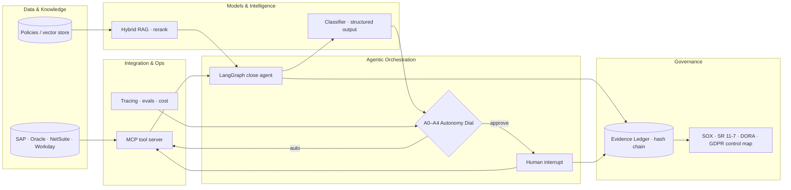

<h1 align="center">Lights-Out Agents</h1>
<p align="center"><b>Agentic AI reference implementation for autonomous ("Lights-Out") finance operations</b><br/>
LangGraph orchestration · A0–A4 Autonomy Dial · hash-chained Evidence Ledger · hybrid RAG with eval gate · MCP-style ERP tools</p>

<p align="center">
<a href="https://github.com/adil-bahir/lights-out-agents/actions/workflows/ci.yml"></a>


</p>

> **Why this exists.** Most "AI agents for finance" demos stop at a chat window. Regulated enterprises need three things a demo never shows: a way to *earn* autonomy on evidence, a way to *prove* what an agent did to an auditor, and a way to *stop* it acting alone when it drifts. This repository is a small, fully tested slice of the five-layer stack I use to deliver exactly that — the same vocabulary as my production work, without client code.
>
> Companion to **[Lights Out Finance](https://lightsoutfinance.net)** — autonomous finance for CFOs: the continuous close, self-steering planning, self-evidencing controls.

Runs **fully offline** (no API keys) so tests and evals are reproducible in CI; plug in Claude / GPT-4.x / Cohere with two env vars.

## Read this repo in 10 minutes

| Minute | Open | You will see |
|---|---|---|
| 0–2 | `python examples/run_close.py --level A3` | six reconciling items closed touchlessly, ledger verified |
| 2–4 | `python examples/run_close.py --level A1` | the same run pausing on a LangGraph `interrupt` for human approval, then resuming |
| 4–6 | [`autonomy/dial.py`](src/lights_out/autonomy/dial.py) · [ADR-0001](docs/adr/0001-autonomy-dial.md) | how autonomy is *earned* (accuracy × samples × incident rate) and *demoted* |
| 6–8 | [`ledger/evidence_ledger.py`](src/lights_out/ledger/evidence_ledger.py) · [ADR-0002](docs/adr/0002-evidence-ledger.md) | hash chain, `verify_chain()`, control-ID pulls |
| 8–10 | [`evals/harness.py`](src/lights_out/evals/harness.py) · [`ci.yml`](.github/workflows/ci.yml) | eval thresholds that fail the build **and** gate autonomy — the same numbers |

## Eval gate (current `main`)

| Metric | Threshold | Current |
|---|---|---|
| Classifier accuracy (golden set) | ≥ 0.90 | **1.00** |
| Classifier incident rate (confident wrong mutation) | ≤ 0.002 @A4 | **0.00** |
| RAG hit@4 | ≥ 0.85 | **1.00** |
| RAG citation precision | ≥ 0.90 | **1.00** |
| RAG refusal accuracy (out-of-corpus questions) | = 1.00 | **1.00** |

Golden sets are deliberately small and readable (`data/*.jsonl`); the point is the *mechanism* — extend them and the gate follows.

## What's in here

| Module | What it demonstrates | Production analogue |
|---|---|---|
| `agents/close_orchestrator.py` | **LangGraph** bank-to-GL close agent: `fetch → match → classify → decide → [human interrupt] → act → summarise`. Typed state, conditional edges, checkpointer, resumable human-in-the-loop. | Same graph, checkpointer on Postgres, tools on an MCP server, traced in LangSmith/Langfuse |
| `autonomy/dial.py` | **A0–A4 Autonomy Dial**: runtime decision (confidence × materiality → auto / human approval / escalate) and the **ratchet** — levels are earned on eval evidence and demoted on incident. | Per-function autonomy policy governed by model-risk committee (SR 11-7) |
| `ledger/evidence_ledger.py` | **Hash-chained Evidence Ledger**: every agent action, autonomy decision and human intervention is an immutable, control-mapped record; `verify_chain()` is a pure function an auditor can run on the export. | WORM/object-lock store; regulator-facing evidence pulls by control ID |
| `tools/erp_tools.py` | **MCP-style typed tools** for GL, bank and journal posting (Pydantic schemas → JSON schema, idempotent mutations). | Adapters over SAP OData/BAPI, Oracle Fusion, NetSuite SuiteTalk, Workday, published via an MCP server |
| `rag/pipeline.py` | **Enterprise RAG** over finance policies: sentence-aware chunking, **hybrid BM25 + dense** retrieval with reciprocal-rank fusion, reranking, grounded answers with chunk citations and explicit refusal. | Cohere Embed v3 + Rerank v3 (or OpenAI/Voyage), pgvector / Qdrant index |
| `evals/harness.py` | **Eval harness → CI gate**: golden datasets, classifier accuracy/incident rate, RAG hit@k / citation precision / refusal accuracy; thresholds fail the build and **gate autonomy promotion**. | RAGAS / LangSmith datasets, regression gates in GitHub Actions |
| `llm/provider.py` | **Model routing + structured outputs**: cheap model for classification, stronger model for drafting; Pydantic contract via `with_structured_output`; heuristic cross-check as a guardrail; deterministic offline fallback. | Anthropic / OpenAI / Bedrock / Vertex, prompt caching, cost & latency budgets |

## Architecture



## Quick start

```bash
pip install -e ".[dev]"
pytest -q                                   # 10 tests, offline
python examples/run_close.py --level A3     # lights-out below materiality; unknowns escalate
python examples/run_close.py --level A1     # pauses on LangGraph interrupt for human approval, then resumes
python examples/run_evals.py                # eval report + CI gate (exit 1 on breach)
```

Turn on a real model (optional):

```bash
export LLM_PROVIDER=anthropic ANTHROPIC_API_KEY=...     # or LLM_PROVIDER=openai OPENAI_API_KEY=...
pip install -e ".[llm]"
```

The classifier then uses `with_structured_output(ExceptionDecision)`; the heuristic stays on as a **guardrail cross-check** — a confident LLM answer that disagrees with a high-confidence heuristic is down-weighted so the autonomy dial routes it to a human.

## What a run looks like

```
$ python examples/run_close.py --level A3
{
  "items": 6,
  "outcomes": {"matched": 3, "posted": 2, "carried_forward": 1},
  "touchless_rate": 1.0,
  "ledger_head": "345f06f9…dea4",
  "autonomy_level": "A3"
}
evidence ledger: 16 entries, verified=True
```

Six reconciling items: two exact matches, one reference-format mismatch, one short payment (bank fee) and one bank charge auto-posted as adjustments, one 47k receipt in transit carried forward. At **A1** the same run pauses on a LangGraph `interrupt` with three items awaiting approval and resumes with the reviewer's decisions — each recorded in the ledger under `SOX-R2R-05` / `DORA-Art9 human oversight`.

## Repository map

```
src/lights_out/
  agents/close_orchestrator.py   LangGraph graph: fetch → match → classify → decide → [interrupt] → act → summarise
  autonomy/dial.py               A0–A4 policy: runtime routing + evidence-based ratchet
  ledger/evidence_ledger.py      hash-chained, control-mapped ledger + independent verifier
  tools/erp_tools.py             MCP-style typed tools (GL, bank, idempotent journal posting)
  rag/pipeline.py                chunking, BM25 ⊕ dense (RRF), rerank, grounded answer / refusal
  evals/harness.py               golden-set metrics → CI gate → autonomy gate
  llm/provider.py                model routing, structured outputs, heuristic guardrail, offline fallback
data/                            policies (RAG corpus) + golden sets
docs/adr/                        architecture decision records
examples/                        run_close.py, run_evals.py
tests/                           10 tests, offline
```

## Design principles

1. **Autonomy is earned, not configured.** `AutonomyPolicy.promote()` only moves a function up a level when the eval harness supplies accuracy, sample size and incident-rate evidence; a breach demotes it. The CI gate and the autonomy gate are the same numbers.
2. **Every action is evidence.** Agents don't produce logs; they produce ledger entries mapped to the control they satisfy. Verification is independent of the producing system.
3. **Deterministic where it matters.** Matching, materiality and idempotent posting are code, not prompts. The model classifies and explains; it doesn't decide whether it may act.
4. **Offline-first, provider-agnostic.** The whole stack runs without keys so tests and evals are reproducible; models, embedders, rerankers and vector stores are injectable.

## Roadmap

- MCP server exposing `erp_tools` (stdio + HTTP) and a LangGraph `ToolNode` variant of the graph
- Postgres checkpointer + pgvector index; Cohere Embed/Rerank adapters
- LangSmith / Langfuse tracing hooks and cost-per-item telemetry into the ledger
- Second function: touchless sales-order processing (Order-to-Cash) on the same dial and ledger

## Contributing & security

See [CONTRIBUTING.md](CONTRIBUTING.md) (ground rules: determinism first, offline CI, every action is evidence, evals gate features) and [SECURITY.md](SECURITY.md). Cite via [CITATION.cff](CITATION.cff).

## Author

**Adil Bahir** — Partner, Enterprise AI Enablement & CFO Advisory (KPMG, EMEA); DEng (AI/ML), MBA, MFin, CFA, CPA. Founder, [Lights Out Finance](https://lightsoutfinance.net).

MIT License.
